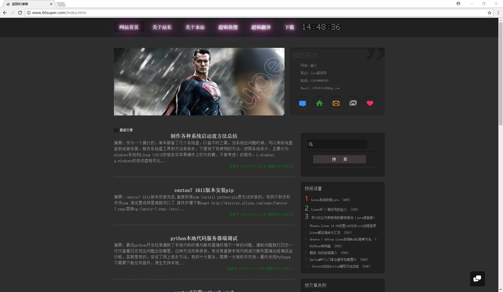
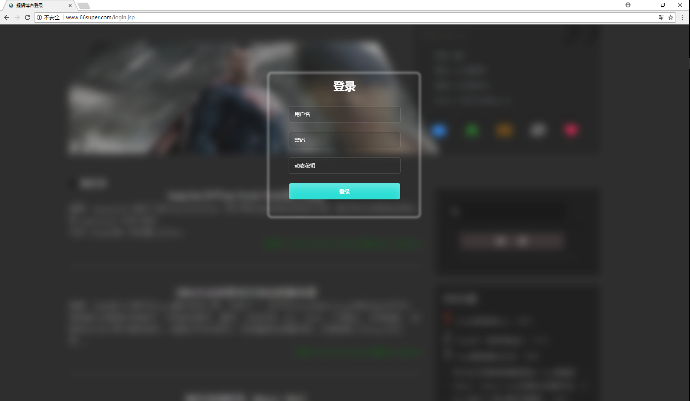
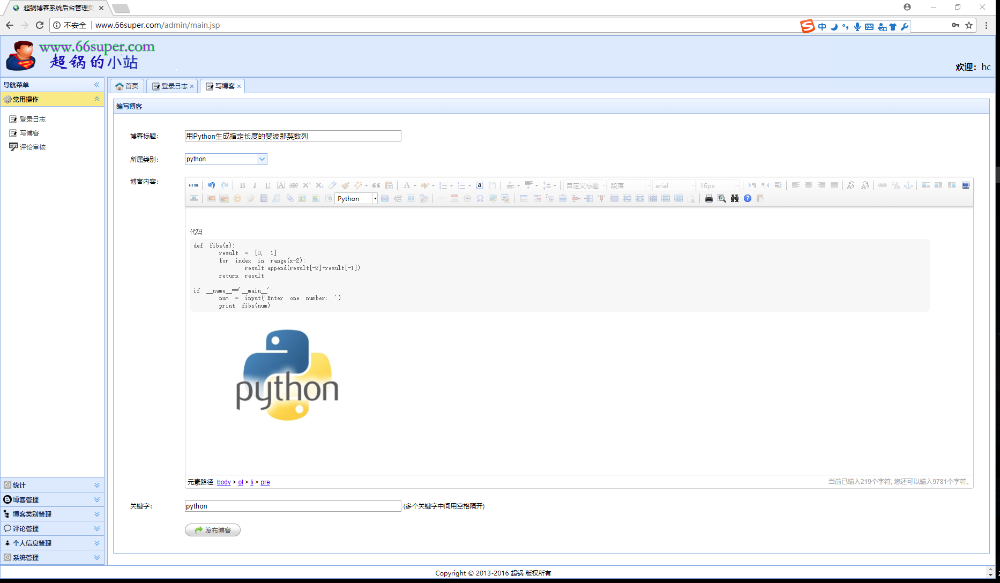
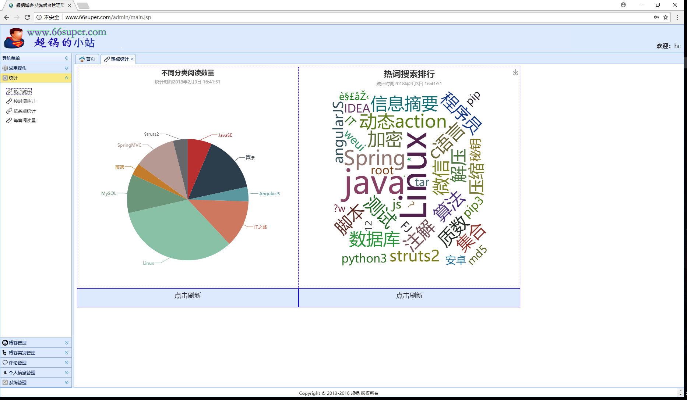
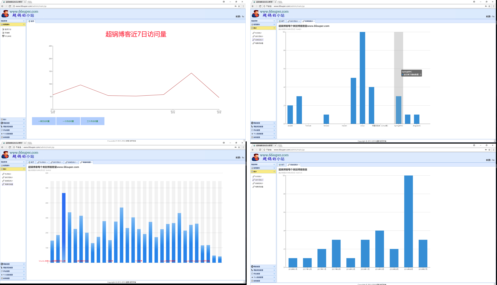
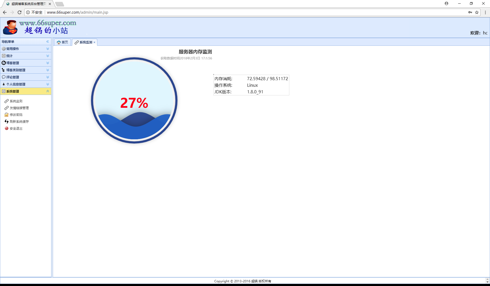

## Blog
## **[简体中文](README.md)** **[English](README_en.md)**

##### 我的个人单用户博客项目 
 
- 编程语言: Java, JavaScript
- 开发工具: IntelliJ IDEA
- 数据库: MySQL 5.5
- 特色
	- 博客，博客类型 增删改查.
	- 博客支持图片和附近.
	- 博客内容关键字搜索支持关键字高亮.
	- 普通用户可以查看和评论.


线上地址 http://66super.com 

### 关于

喜欢该项目的话，可以给项目点个 star，如果你想在这基础上修改，那么建议你 fork 该项目，然后再修改哦。


### 运行项目

 clone本项目到电脑. 本项目使用maven管理依赖，确保你电脑安装maven并配置正确.

#### 修改数据库库源 `resources\applicationContext.xml`.

```
<property name="url" value="jdbc:mysql://localhost:3306/db_blog?useUnicode=true&amp;characterEncoding=UTF-8"/>
<property name="username" value="root"/>
<property name="password" value="superman"/>
```


在doc/db/db.sql使用初始化sql文件将数据导入到mysql blog数据库中

配置项目并运行tomcat

浏览器访问  `http://127.0.0.1:8080/`! 

## 功能如下：

### 博客首页：
 


 
 **后台管理**
 
### 管理员登录：
 
 
### 写博客：
  
  
### 热点统计：
   
   
### 博客相关统计：
  
  
### 系统监测：
  
 
 
## 开源协议

[MIT](./LICENSE)

