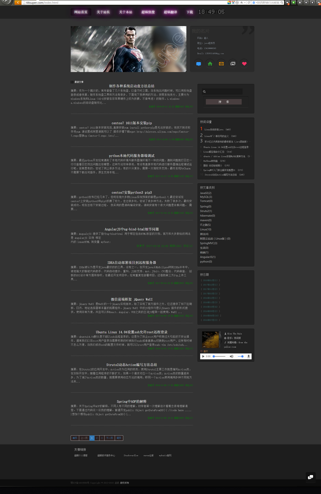

## **[简体中文](README.md)** **[English](README_en.md)**

## Blog

This project is my homepage with a blog system. Blog articles can be added and modified by admin, while readers can read and rely.

- Programming Languages: Java8, JavaScript
- Programming Tool: IntelliJ IDEA
- database:MySQL 5.5
- Features
	- Add, modify and delete the category and blog.
	- Add pictures or attachment file in a blog.
	- Search a blog by keyword of title.
	- Review and comment.

Visit http://66super.com to view this blog system.


### about

if you like this project.You can fork it, and modify these HTML document to create your own blog system:


### How to run

Clone this blog system to your computer. This project is managed by **Maven**, be sure you have installed **Maven** in your computer.

You should create database before running this blog system, the character set should be utf-8. After that, just modify database configuration in `resources\applicationContext.xml`.

```
<property name="url" value="jdbc:mysql://localhost:3306/db_blog?useUnicode=true&amp;characterEncoding=UTF-8"/>
<property name="username" value="root"/>
<property name="password" value="superman"/>
```

see doc/db/db.sql and import initialization sql file to mysql database of blog

Visit `http://127.0.0.1:8080/`! 

## view：

 blog index：
 


 
 **backend**
 
### admin login：
 
 
  
 ### write blog：
   
   
 ### hot topic statistics：
    
    
 ### blog statistics：
   
   
 ### system monitoring：
   
 
 
 
## open source licence

[MIT](./LICENSE)
	


